# LEVI

**Estudante de Ciencia da Computacao | Engenheiro Full-Stack & Cloud Infrastructure**

Desenvolvimento full-stack, infraestrutura em nuvem e automacao de pipelines.
Atualmente construindo o [DevRank](https://devrank.com.br/), plataforma de aprendizado e execucao pratica de codigo.

---

## Stack Tecnica

**Linguagens**
`Python` • `JavaScript` • `TypeScript` • `PHP` • `Go` • `SQL` • `HTML5/CSS3`

**Frameworks & Runtime**
`Node.js` • `Next.js` • `React` • `FastAPI` • `Streamlit` • `TailwindCSS` • `REST APIs` • `WebSockets`

**Cloud & Infraestrutura**
`AWS` • `Azure` • `GCP` • `Cloudflare` • `Terraform` • `Docker` • `Kubernetes` • `Nginx` • `Linux/Bash`

**Dados**
`PostgreSQL` • `MySQL` • `MongoDB` • `Redis` • `SQLite` • `DuckDB` • `Polars` • `pandas` • `SQLAlchemy` • `Parquet`

**Seguranca, CI/CD & Observabilidade**
`Semgrep SAST` • `GitHub Actions` • `Ansible` • `Zabbix` • `Prometheus` • `Grafana` • `Wireshark`

---

## Projetos em Destaque

| Projeto | Status | Descricao | Stack Principal | Link |
| --- | --- | --- | --- | --- |
| **DevRank** | Producao | Plataforma de aprendizado e execucao pratica de codigo via CLI e IDE web integrada, com trilhas padronizadas de exercicios e a infraestrutura de cloud e seguranca que a sustenta. | Python, Next.js, Cloudflare, Resend | [devrank.com.br](https://devrank.com.br/) |
| **TechStore** | Demo | Loja ficticia de e-commerce usada como vitrine tecnica: catalogo, carrinho, checkout e area administrativa. Deploy em producao na **Azure** (App Service + PostgreSQL gerenciado), com pipeline de entrega continua. | Next.js, Node.js, Azure, PostgreSQL | [GitHub](https://github.com/LeviRunner) |
| **DataLens** | Demo | Analise de dados configuravel: gera o perfil automatico de qualquer fonte — CSV, Excel, SQL, JSON ou API — sem alterar codigo. Detecta tipos, faltantes, estatisticas e distribuicoes, com pipeline de limpeza auditavel e relatorio exportavel. | Python, Streamlit, DuckDB, Polars | [GitHub](https://github.com/LeviRunner) |

